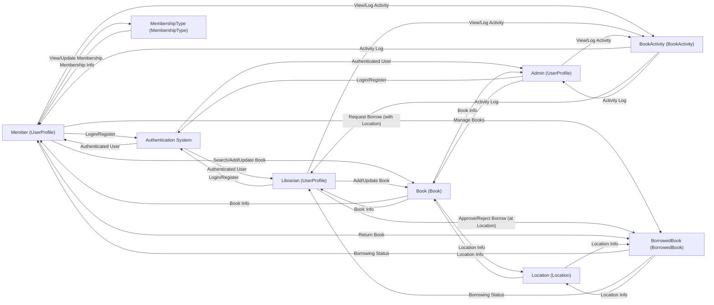

# Library Management System DFD (Level 1)

## Summary
- Modular Django REST API for library management
- Membership-based borrow limits (enforced per user)
- Borrow/request/approval flow: Members request books for a location, librarians approve/reject, status tracked
- Book location tracking: Each book is assigned to a location; borrow/return is location-aware

