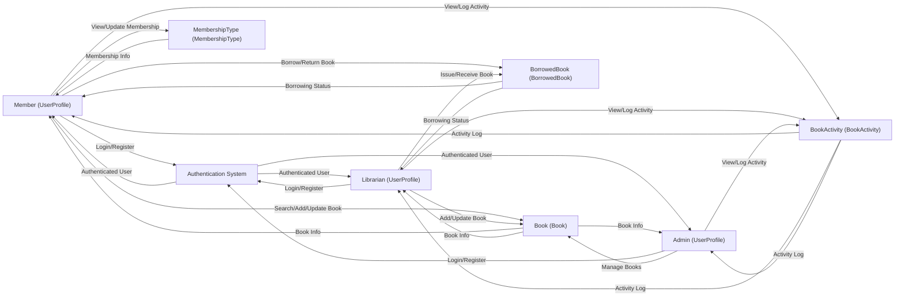

# Library Management System DFD (Level 1)

```mermaid
graph LR
    Member["Member (UserProfile)"]
    Librarian["Librarian (UserProfile)"]
    Admin["Admin (UserProfile)"]
    Auth["Authentication System"]
    BookDB["Book (Book)"]
    BorrowDB["BorrowedBook (BorrowedBook)"]
    ActivityDB["BookActivity (BookActivity)"]
    MembershipDB["MembershipType (MembershipType)"]

    Member -- "Login/Register" --> Auth
    Librarian -- "Login/Register" --> Auth
    Admin -- "Login/Register" --> Auth
    Auth -- "Authenticated User" --> Member
    Auth -- "Authenticated User" --> Librarian
    Auth -- "Authenticated User" --> Admin

    Member -- "Search/Add/Update Book" --> BookDB
    Librarian -- "Add/Update Book" --> BookDB
    Admin -- "Manage Books" --> BookDB
    BookDB -- "Book Info" --> Member
    BookDB -- "Book Info" --> Librarian
    BookDB -- "Book Info" --> Admin

    Member -- "Borrow/Return Book" --> BorrowDB
    Librarian -- "Issue/Receive Book" --> BorrowDB
    BorrowDB -- "Borrowing Status" --> Member
    BorrowDB -- "Borrowing Status" --> Librarian

    Member -- "View/Log Activity" --> ActivityDB
    Librarian -- "View/Log Activity" --> ActivityDB
    Admin -- "View/Log Activity" --> ActivityDB
    ActivityDB -- "Activity Log" --> Member
    ActivityDB -- "Activity Log" --> Librarian
    ActivityDB -- "Activity Log" --> Admin

    Member -- "View/Update Membership" --> MembershipDB
    MembershipDB -- "Membership Info" --> Member
```
