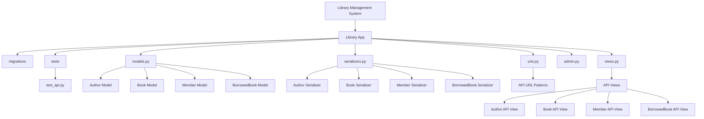
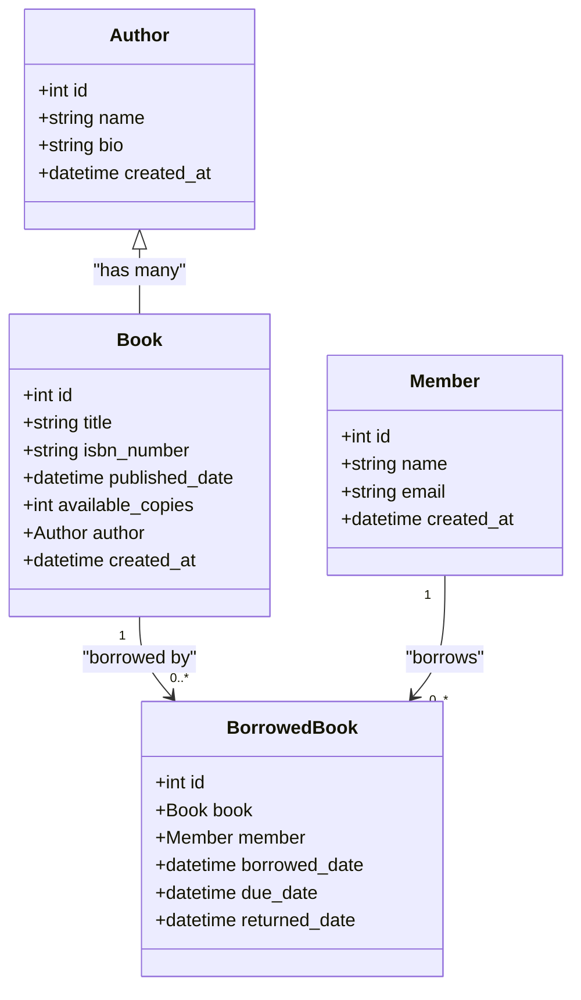
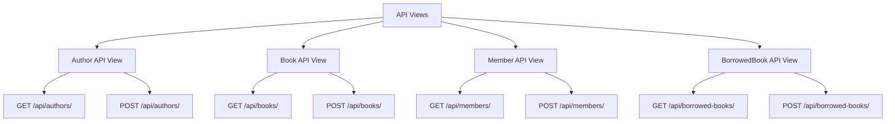
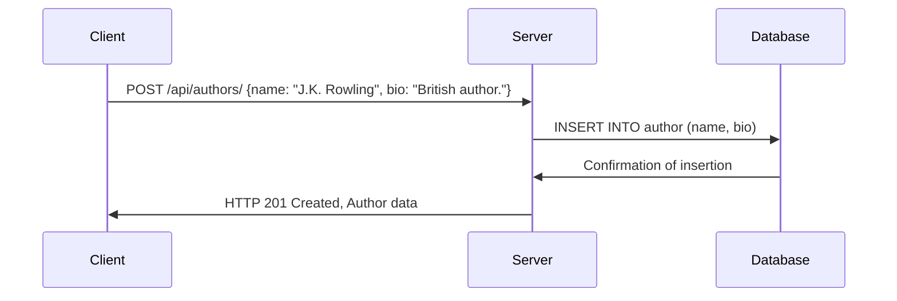
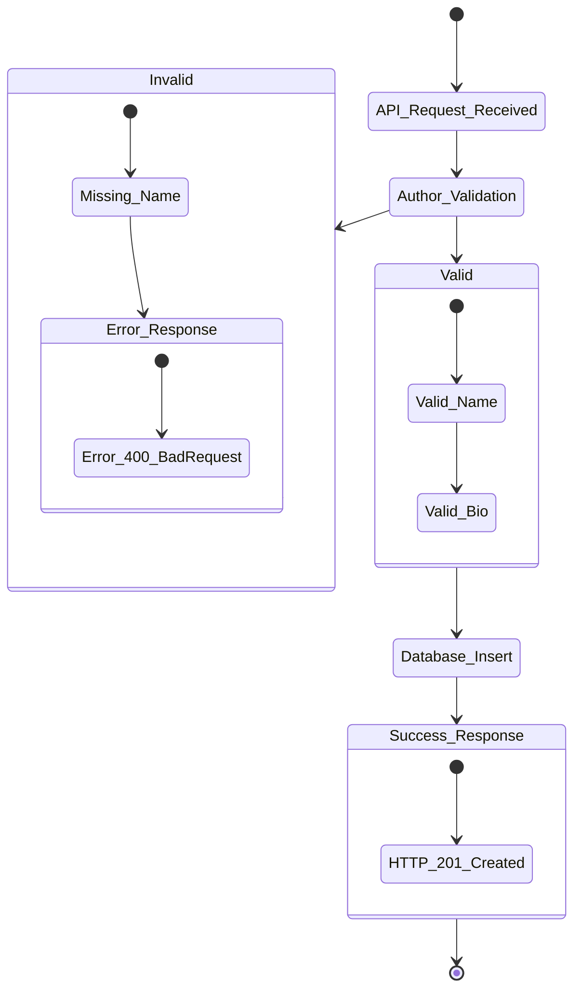
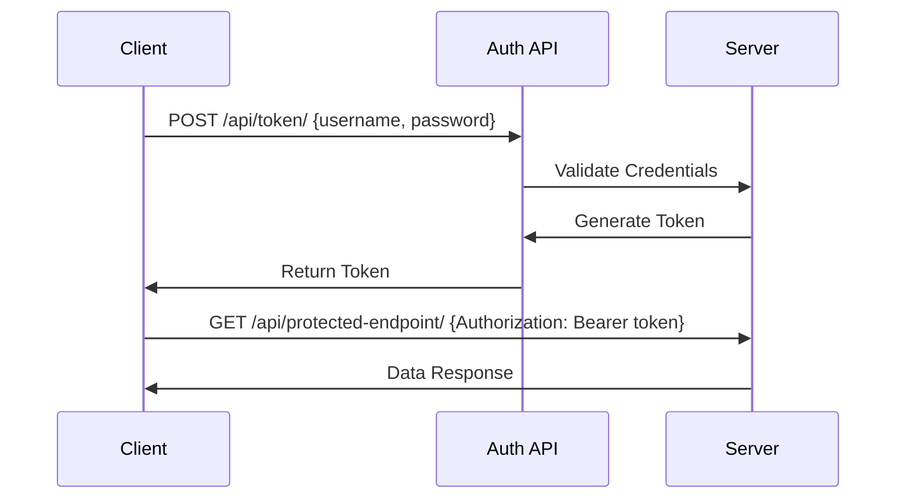

### 1. **Project Structure Diagram**

This diagram shows the high-level structure of your project and how the files and directories are organized.



### 2. **Models and Relationships Diagram**

This diagram shows the relationships between different models (`Author`, `Book`, `Member`, and `BorrowedBook`).



### 3. **API Views and URL Patterns**

This diagram visualizes the mapping between API views and their corresponding URL patterns.



### 4. **Test Setup and Database Creation**

This diagram shows the flow of setting up the test database, applying migrations, and running tests.

```mermaid
graph LR;
    A[Run Tests] --> B[Create Test Database]
    B --> C[Apply Migrations]
    C --> D[Create Tables (e.g., library_author, library_book)]
    A --> E[Run Test Case]
    E --> F[Test API Endpoint]
    F --> G[Validate Response]
    G --> H[Check Database Entries]
    G --> I[Assert API Status Codes]
```

### 5. **API Call Flow Diagram**

This diagram visualizes the flow of an API call when creating a new `Author`.



### 6. **Example API Response for Author Creation**

This diagram demonstrates how the response might flow in case of valid and invalid data submission for creating an `Author`.



### 7. **API Authentication Flow**

This diagram shows how the authentication process works, especially for token-based authentication in your API.



---
