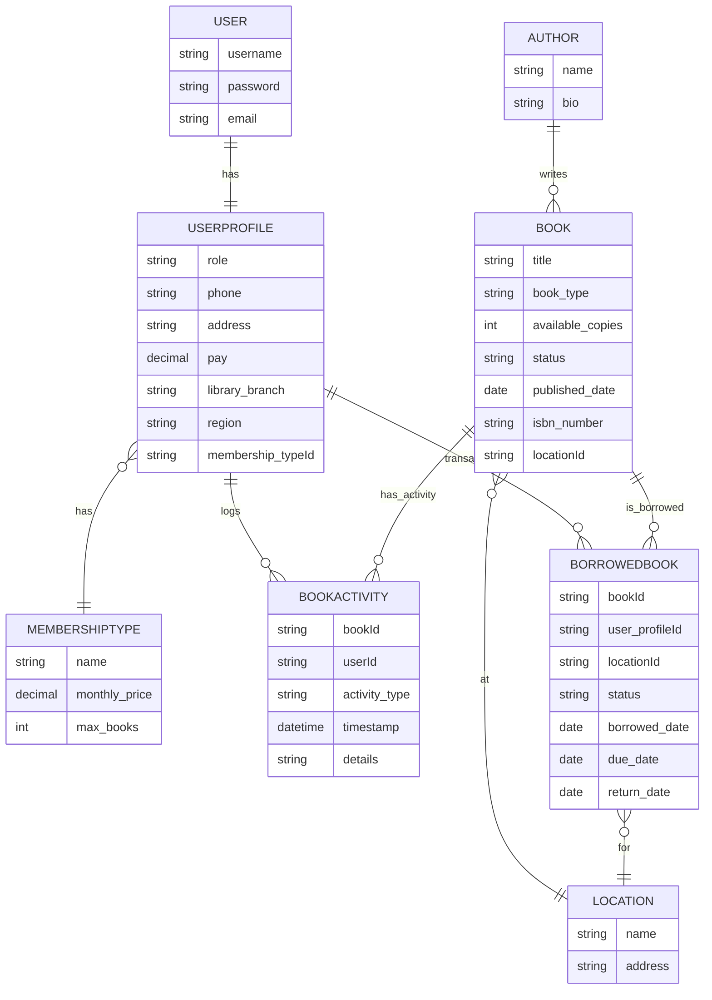

# Library Management System Schema (Refined)

## Summary (Quick Reference)
- Modular Django REST API for library management
- Membership-based borrow limits (enforced per user)
- Borrow/request/approval flow: Members request books for a location, librarians approve/reject, status tracked
- Book location tracking: Each book is assigned to a location; borrow/return is location-aware
- All detailed docs are in the `design/` folder

## User & Roles
- **User** (Django built-in)
- **UserProfile** (one-to-one with User)
  - role: CharField (choices: 'admin', 'librarian', 'member', 'self_checkout')
  - phone, address, etc.
  - membership_type: ForeignKey(MembershipType, null=True, blank=True) (for members)

## MembershipType
- name: CharField
- monthly_price: DecimalField
- max_books: PositiveIntegerField
- ...

## Author
- name: CharField
- bio: TextField

## Book
- title: CharField
- author: ForeignKey(Author)
- published_date: DateField
- isbn_number: CharField (unique)
- book_type: CharField (choices: 'physical', 'virtual')
- available_copies: PositiveIntegerField (for physical books)
- status: CharField (choices: 'available', 'racked', 'discarded', 'purchased')

## BorrowedBook
- book: ForeignKey(Book)
- user_profile: ForeignKey(UserProfile)
- location: ForeignKey(Location)
- status: CharField (choices: 'requested', 'approved', 'rejected', 'returned')
- borrowed_date: DateField
- due_date: DateField
- return_date: DateField (nullable)
- transacted_by: ForeignKey(UserProfile or null for self_checkout)
## Location
- name: CharField
- address: TextField

## BookActivity
- book: ForeignKey(Book)
- user: ForeignKey(UserProfile or null for self_checkout)
- activity_type: CharField (choices: 'borrow', 'return', 'rack', 'purchase', 'discard')
- timestamp: DateTimeField
- details: TextField (optional)

---
- All actions (borrow, return, rack, purchase, discard) are logged in BookActivity with the user (admin/librarian/member/self_checkout) who performed them.
- Virtual books ignore available_copies (treated as unlimited).
- Membership type and borrowing limits are managed in MembershipType and referenced in UserProfile.
- Borrow/request/approval flow: Members request books for a location, librarians at that location approve/reject, status tracked in BorrowedBook.
- Membership enforcement: Members cannot exceed their borrow limit (active borrows only).
- Location enforcement: Only librarians at the book's location can approve/reject requests.
