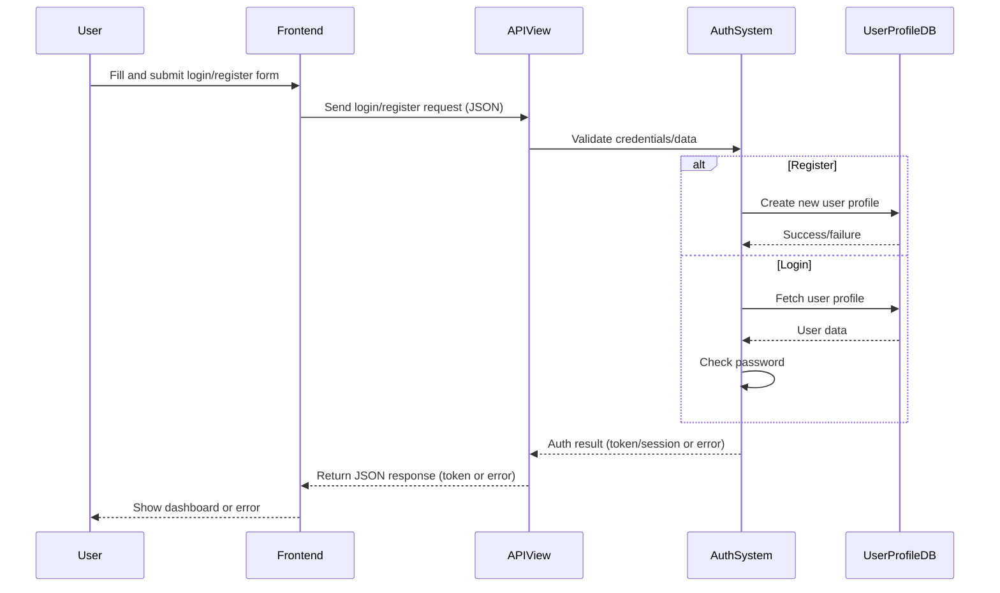
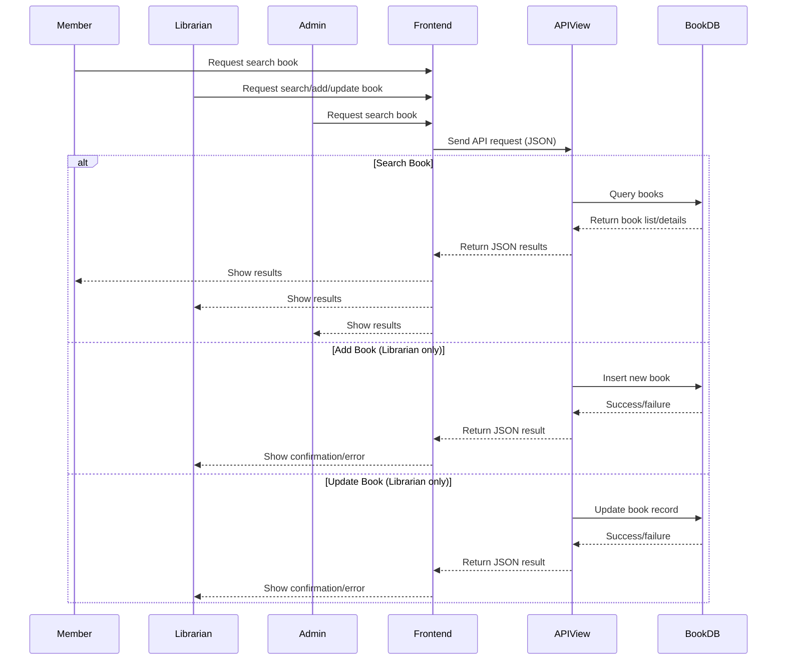
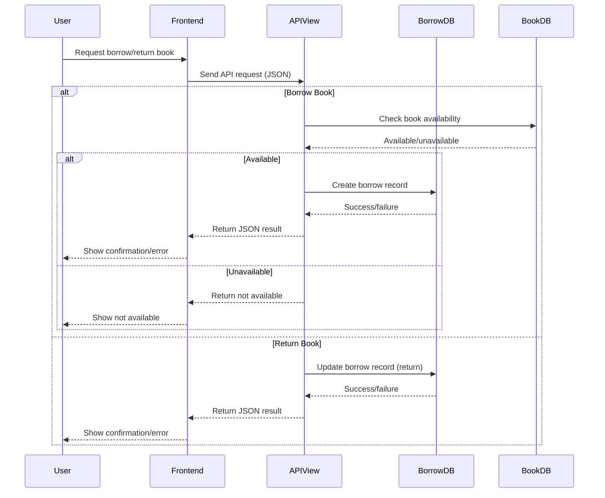
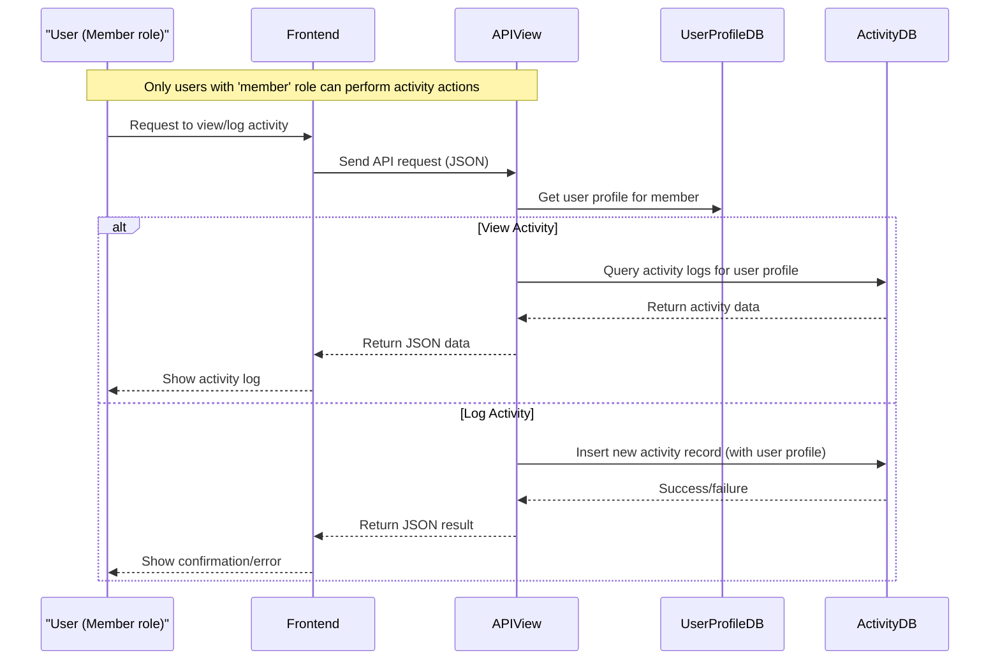
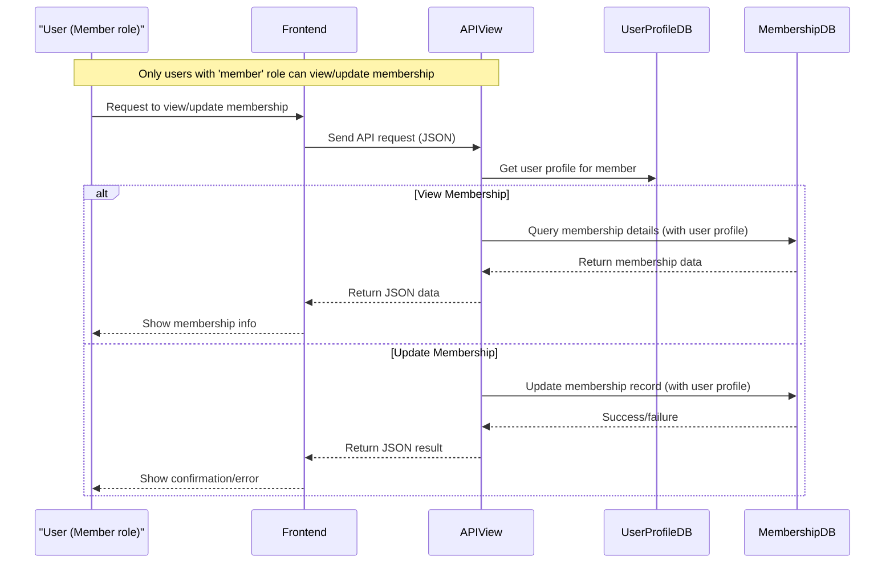

# Library Management System – Sequence Diagrams

This document contains sequence diagrams for the main endpoints/processes identified from the DFD. Diagrams are written in Mermaid syntax for easy integration and visualization.

## 1. Login/Register (Authentication)

---

## 2. Search/Add/Update Book (Book Management)

---

## 3. Borrow/Return Book (Borrowing Process)

---

## 4. View/Log Activity (Activity Tracking)

---

## 5. View/Update Membership (Membership Management)

---
